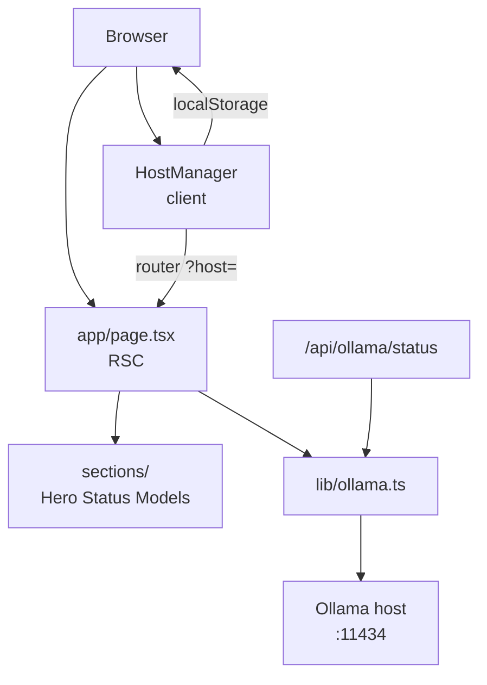

# Ollama Panel

Local-first web dashboard for monitoring one or more [Ollama](https://ollama.com) hosts. See host online/offline status, Ollama version, installed models, running models, and switch between hosts from the browser.

## Prerequisites

- **Node.js** 20 or newer
- **Ollama** running locally (default API: `http://localhost:11434`)

## Setup

```bash
git clone <repo-url>
cd ollama_panel
npm install
```

## Start

```bash
npm run dev
```

Open [http://localhost:3000](http://localhost:3000).

If Ollama is not running, the panel still loads and shows an offline state for the selected host.

## Usage

- **Default host:** `http://localhost:11434`
- **Add / remove hosts:** use the host manager in the UI (non-default hosts can be removed)
- **LAN / shorthand hosts:** you can enter an IP or hostname without a full URL, for example `192.168.1.10`, `192.168.1.10:11434`, or `my-server.local:11434`. The panel prepends `http://` when needed and uses port **11434** when you omit a port.
- **Persistence:** host list is stored in `localStorage`
- **Switch host:** select a host in the UI; the app navigates with `?host=` and refreshes server-rendered status and models. Shorthand in `?host=` (e.g. `/?host=192.168.1.10`) is normalized the same way as in the add-host dialog.

## Scripts

| Command | Description |
|---------|-------------|
| `npm run dev` | Development server |
| `npm run build` | Production build |
| `npm run start` | Run production server |
| `npm run lint` | ESLint |

## Architecture



- **Server data layer:** [`lib/ollama.ts`](lib/ollama.ts) normalizes and validates host input (IPs, hostnames, full URLs; `http:` / `https:` only; default port 11434), then calls Ollama `GET /api/version`, `GET /api/tags`, and `GET /api/ps`.
- **API route:** [`app/api/ollama/status/route.ts`](app/api/ollama/status/route.ts) proxies host status so the browser avoids CORS issues.
- **UI:** three React Server Components in [`components/sections/`](components/sections/) (`HeroSection`, `StatusSection`, `ModelsSection`) plus one client component [`components/HostManager.tsx`](components/HostManager.tsx) for host CRUD and selection.
- **Styling:** design tokens in [`app/globals.css`](app/globals.css), defined in [`docs/DESIGN.md`](docs/DESIGN.md).

## Project docs

| Doc | Purpose |
|-----|---------|
| [docs/PRD.md](docs/PRD.md) | Product spec, data model, API contract |
| [docs/DESIGN.md](docs/DESIGN.md) | Design tokens and component guidelines |
| [docs/DEVELOPMENT.md](docs/DEVELOPMENT.md) | Implementation milestones |
| [AGENTS.md](AGENTS.md) | AI coding rules for contributors |

## Design note

The UI uses the official [**Porsche Design System**](https://designsystem.porsche.com/) React package and Tailwind theme.

| Reference | Role in this project |
|-----------|----------------------|
| [Porsche Web Design System v4 (Figma)](https://www.figma.com/community/file/1385198638659084461/web-design-system-v4) | Layout and component reference |
| [designsystem.porsche.com](https://designsystem.porsche.com/) | PDS documentation |

What is integrated:

- `@porsche-design-system/components-react` with SSR provider and font partials
- PDS Tailwind theme in [`app/globals.css`](app/globals.css)
- PDS components: `PButton`, `PTag`, `PModal`, `PInputText`, `PHeading`, `PText`, `PInlineNotification`
- Thin wrappers in [`components/ui/`](components/ui/) where helpful for shared patterns

The dashboard layout is tuned for this app (1120px content width, Ollama-specific sections). It may still differ from every screen in the Figma community file because that file is a full design system library, not this product’s final mockups.

## Troubleshooting

| Issue | What to check |
|-------|----------------|
| Host shows offline | Start Ollama; confirm the host URL (default `http://localhost:11434`). For a LAN machine, ensure Ollama is running and reachable at `http://<ip>:11434`. |
| LAN host unreachable | On the Ollama machine, bind to the network (e.g. `OLLAMA_HOST=0.0.0.0`) and allow firewall access to port 11434. The panel does not scan the subnet. |
| Invalid host URL | Use an IP, hostname, or `http://` / `https://` URL; port defaults to 11434 when omitted. |
| Empty model lists | Host may be online with no models pulled yet |

**Security:** This panel is intended for **local Ollama version** first. If you deploy it publicly, revisit host URL validation and server-side fetch rules in [docs/PRD.md](docs/PRD.md).
